# ⚡ DOS.RADAR — Real-Time Threat Intelligence Platform

<!-- HERO SCREENSHOT -->

<p align="center">
  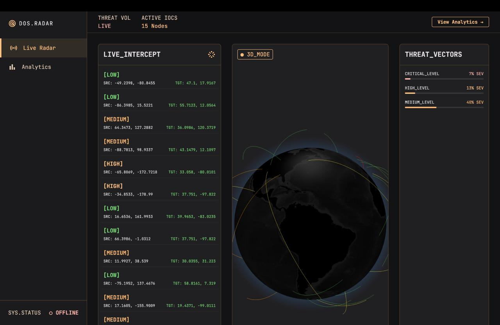
  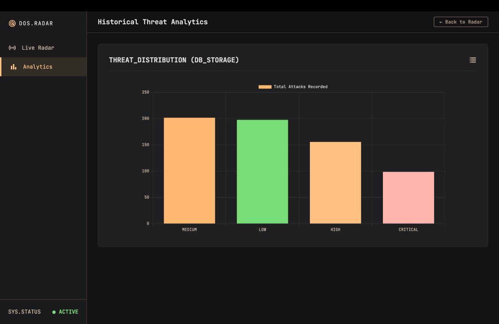
</p>

<p align="center">
  <b>Real-Time Cyber Threat Visualization • IOC Intelligence • WebSocket Streaming • 3D Geospatial Visualization</b>
</p>

<p align="center">
  
  
  
  
  
  
</p>

---

## 🌐 Overview

**DOS.RADAR** is an enterprise-style, real-time cybersecurity intelligence dashboard designed to visualize active Distributed Denial-of-Service (DDoS) and botnet-related threats across the globe.

The platform continuously ingests live **Indicators of Compromise (IOCs)** from threat-intelligence feeds, enriches them with geolocation data, persists historical events in MongoDB, and streams live attack telemetry to a React-based dashboard through WebSockets.

The result is an interactive **3D cyber-threat monitoring system** that combines real-time event streaming, geospatial visualization, historical analytics, and a cybersecurity-focused interface.

---

# 🎯 What DOS.RADAR Does

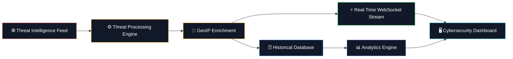

---

# ✨ Key Features

### 🔴 Live Threat Intelligence

* Integrates with **Abuse.ch Feodo Tracker**
* Continuously retrieves active malicious infrastructure
* Processes live IP-based Indicators of Compromise
* Automatically enriches IPs with geographical information

### ⚡ Real-Time Event Streaming

* Uses **Socket.io** for bidirectional communication
* Threat events are pushed to connected clients immediately
* No manual page refresh required
* Designed for high-frequency event streams

### 🌍 3D Threat Visualization

* Interactive WebGL globe
* Built using `globe.gl` and `Three.js`
* Visualizes attack vectors geographically
* Animated arcs represent threat activity between locations
* Dynamic threat markers provide visual situational awareness

### 🗄️ High-Throughput Persistence

Instead of writing every incoming event directly to MongoDB, DOS.RADAR uses an in-memory batching strategy.

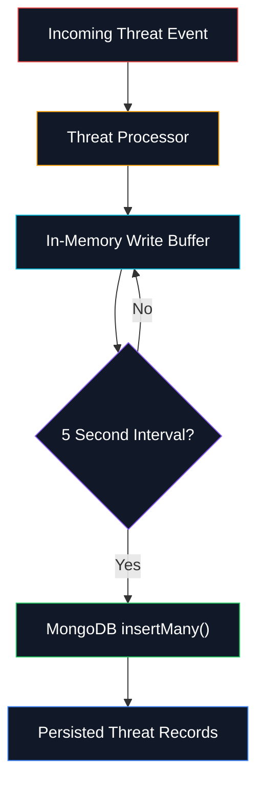

This reduces database I/O and avoids performing an expensive database operation for every single incoming threat.

### 📊 Historical Analytics

MongoDB aggregation pipelines are used to calculate historical threat statistics.

The analytics layer can provide information such as:

* Threat volume
* Severity distribution
* Geographic distribution
* Attack frequency
* Historical trends
* Threat categories

---

# 🧠 System Architecture

The complete platform follows a **pipeline-based event architecture**.

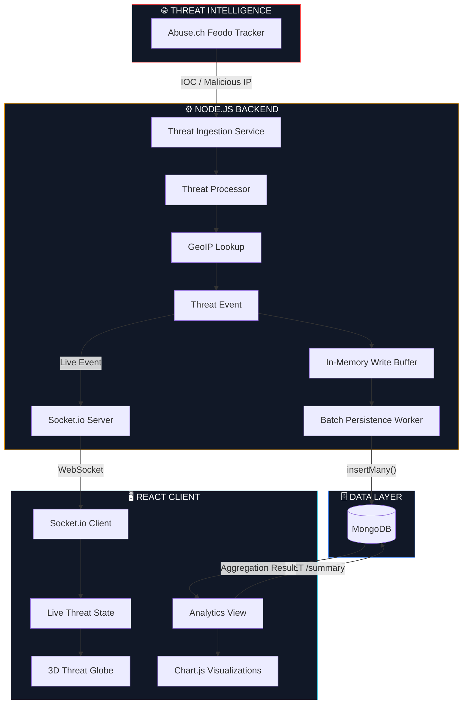

---

# 🔄 Real-Time Threat Data Flow

A single threat event follows this pipeline:

```mermaid
sequenceDiagram

    autonumber

    participant FEED as 🌐 Abuse.ch
    participant INGEST as ⚙️ Ingestion Engine
    participant PROC as 🧠 Threat Processor
    participant GEO as 📍 GeoIP
    participant BUFFER as 📦 Write Buffer
    participant SOCKET as ⚡ Socket.io
    participant CLIENT as 🖥️ React Dashboard
    participant DB as 🗄️ MongoDB

    FEED->>INGEST: Fetch IOC
    INGEST->>PROC: Raw threat data
    PROC->>GEO: Resolve IP location
    GEO-->>PROC: Latitude / Longitude
    PROC->>BUFFER: Queue threat event
    PROC->>SOCKET: Broadcast threat
    SOCKET-->>CLIENT: WebSocket event
    CLIENT->>CLIENT: Update threat state
    CLIENT->>CLIENT: Render 3D globe

    Note over BUFFER,DB: Every 5 seconds

    BUFFER->>DB: insertMany(batch)
    DB-->>BUFFER: Persistence confirmed
```

---

# 🖥️ Frontend Architecture

The frontend is divided into independent responsibilities to keep the real-time rendering layer efficient.

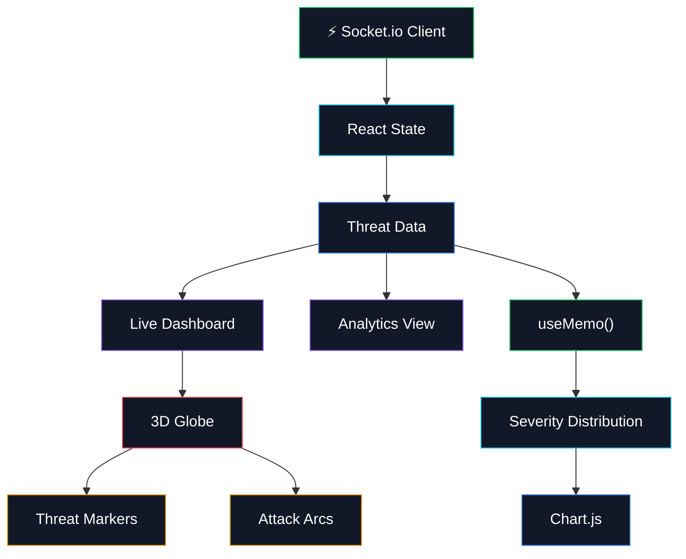

---

# 📊 Analytics View

<!-- ANALYTICS SCREENSHOT -->

<p align="center">
  
</p>

The Analytics interface provides a historical view of collected threat intelligence.

### Analytics Pipeline


---

# 🛠️ Tech Stack

## Frontend

| Technology           | Purpose                    |
| -------------------- | -------------------------- |
| **React.js**         | Component-based UI         |
| **Vite**             | Frontend build tooling     |
| **Tailwind CSS v3**  | Custom cybersecurity UI    |
| **Socket.io-client** | Real-time threat streaming |
| **Globe.gl**         | 3D globe visualization     |
| **Three.js**         | WebGL rendering            |
| **Chart.js**         | Analytics visualization    |

## Backend

| Technology     | Purpose                 |
| -------------- | ----------------------- |
| **Node.js**    | Runtime                 |
| **Express.js** | REST API                |
| **Socket.io**  | WebSocket communication |
| **MongoDB**    | Threat persistence      |
| **Mongoose**   | MongoDB ODM             |
| **Axios**      | Threat-feed ingestion   |
| **GeoIP-Lite** | IP geolocation          |

---

# 🧩 Architecture Highlights

## 1. Event-Driven Architecture

DOS.RADAR uses an event-driven architecture for live threat delivery.

Instead of repeatedly polling the frontend, the server pushes threat events to connected clients through Socket.io.

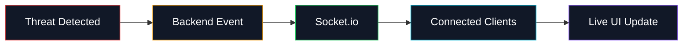

---

## 2. Write-Buffer Pattern

Direct database writes can become expensive when threat events arrive rapidly.

DOS.RADAR therefore uses:

```text
Incoming Events
      ↓
In-Memory Buffer
      ↓
Batch every 5 seconds
      ↓
MongoDB insertMany()
```

### Benefits

* Reduced database operations
* Lower MongoDB overhead
* Better burst handling
* Reduced latency caused by synchronous writes
* More efficient use of database connections

> **Trade-off:** Because the buffer is held in memory, events that exist only in the buffer can be lost if the backend crashes before persistence.

---

# ⚡ Performance Strategy

The application is designed around minimizing unnecessary work.

### Backend

* Batch MongoDB writes
* Reuse database connections
* Process threat events asynchronously
* Broadcast events through WebSockets
* Perform aggregation inside MongoDB rather than transferring large datasets

### Frontend

* Maintain a centralized threat state
* Use `useMemo()` for derived analytics
* Avoid unnecessary React re-renders
* Keep visualization data separate from analytics calculations
* Delegate 3D rendering to WebGL

---

# 🔐 Security Considerations

The application follows several security-oriented principles:

* Environment variables are used for sensitive configuration
* MongoDB credentials are not hardcoded
* API and WebSocket layers are separated
* External threat data is treated as untrusted input
* Backend validation should be applied before persistence
* CORS should be restricted to trusted frontend origins in production

For production deployment, additional controls can include:

* Rate limiting
* Authentication / authorization
* HTTPS
* WebSocket origin validation
* Input sanitization
* API request validation
* MongoDB network restrictions
* Centralized logging and monitoring

---

# 📁 Project Structure

```text
realtime-dos-radar/
│
├── dos-map-backend/
│   │
│   ├── controllers/
│   ├── models/
│   ├── routes/
│   ├── services/
│   ├── utils/
│   ├── server.js
│   ├── package.json
│   └── .env
│
├── dos-map-frontend/
│   │
│   ├── src/
│   │   ├── components/
│   │   ├── pages/
│   │   ├── hooks/
│   │   ├── services/
│   │   ├── context/
│   │   └── App.jsx
│   │
│   ├── package.json
│   └── vite.config.js
│
├── assets/
│   ├── dashboard.png
│   └── analytics.png
│
└── README.md
```

---

# 🚀 Installation & Setup

## Prerequisites

Make sure you have:

* Node.js `18+`
* npm
* MongoDB local instance or MongoDB Atlas
* Git

---

## 1. Clone Repository

```bash
git clone https://github.com/RuDr8A/realtime-dos-radar.git

cd realtime-dos-radar
```

---

# 2. Backend Setup

```bash
cd dos-map-backend

npm install
```

Create a `.env` file:

```env
PORT=3000

MONGO_URI=mongodb://localhost:27017/dos-radar
```

For MongoDB Atlas:

```env
MONGO_URI=mongodb+srv://<username>:<password>@<cluster>/<database>
```

Start the backend:

```bash
npm run dev
```

Expected output should indicate:

```text
Server running on port 3000
MongoDB connected
Threat engine started
```

---

# 3. Frontend Setup

Open a second terminal:

```bash
cd dos-map-frontend

npm install

npm run dev
```

Vite should start the development server at:

```text
http://localhost:5173
```

---

# 🔌 API Overview

| Method | Endpoint   | Purpose                       |
| ------ | ---------- | ----------------------------- |
| `GET`  | `/`        | Backend health check          |
| `GET`  | `/summary` | Historical threat analytics   |
| `GET`  | `/threats` | Retrieve stored threat events |
| `WS`   | Socket.io  | Real-time threat stream       |

> Update this table if your actual backend routes differ.

---

# 🌍 Threat Visualization Pipeline

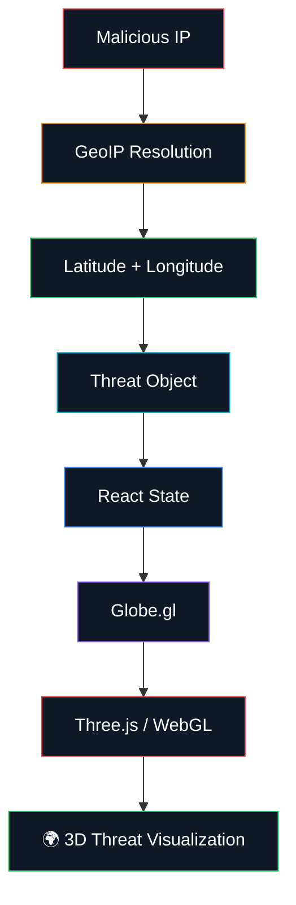

---

# 📈 Scalability Model

The architecture can evolve from a single-node application into a distributed threat-processing system.

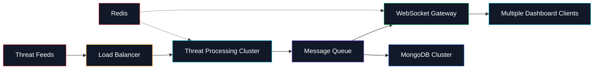

Possible future infrastructure:

* Redis for distributed state
* Kafka / RabbitMQ for event streaming
* Multiple Node.js threat processors
* Horizontal WebSocket scaling
* MongoDB sharding
* CDN-based frontend deployment
* Centralized observability

---

# 🧪 Development Workflow

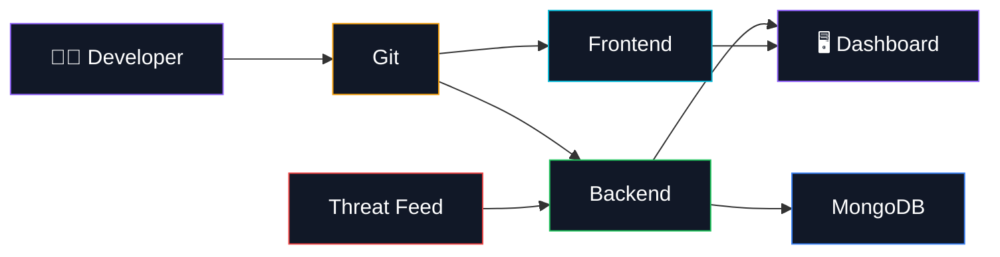

---

# 🔮 Future Improvements

### Threat Intelligence

* [ ] Add additional IOC feeds
* [ ] Add malicious domain intelligence
* [ ] Add malware family classification
* [ ] Add ASN / ISP enrichment
* [ ] Add threat reputation scoring

### Infrastructure

* [ ] Redis caching
* [ ] Kafka-based event pipeline
* [ ] Horizontal WebSocket scaling
* [ ] Background worker architecture
* [ ] Production monitoring

### Security

* [ ] JWT authentication
* [ ] Role-based access control
* [ ] API rate limiting
* [ ] Request validation
* [ ] Audit logging

### Visualization

* [ ] Historical globe playback
* [ ] Attack replay mode
* [ ] Country-level heatmaps
* [ ] ASN visualization
* [ ] Advanced threat filtering
* [ ] Custom time-range analytics

---

# 🧑‍💻 Why This Project?

DOS.RADAR demonstrates the integration of several production-oriented engineering concepts:

```text
Real-Time Systems
       +
Threat Intelligence
       +
WebSockets
       +
Distributed Data Processing
       +
Database Optimization
       +
Geospatial Visualization
       +
Modern React Architecture
```

Rather than being a static cybersecurity dashboard, the project focuses on **continuous event ingestion, processing, persistence, and visualization**.

---

# 📜 License

This project is open-source and available under the **MIT License**.


---

# ⭐ Project

If you find DOS.RADAR interesting, consider giving the repository a ⭐ on GitHub.

**Built with React, Node.js, MongoDB, Socket.io, Three.js and a lot of caffeine.**
